# 💰 CoinRankingCrypto iOS App

## 📖 Overview

An iOS application that fetches cryptocurrency data from the **CoinRanking API** and delivers a rich, secure, and responsive user experience.

### ✨ Highlights
- 🖼 **Splash Screen & Onboarding** — Smooth SwiftUI transitions  
- 📋 **Top 100 Coins List** — Pagination, sorting, and filtering  
- ⭐ **Favorites Management** — Swipe to favorite/unfavorite coins  
- 📈 **Detailed Coin View** — Price history charts and statistics  
- 🌙 **Dark & Light Mode** — Full system appearance support  

---

## 📸 Screenshots

### 🚀 Onboarding & Authentication

| Get Started | Login | OTP Validation |
|-------------|-------|----------------|
|  |  |  |

### 📋 Coin Management

| Coin List | Filter Coins | Make Favorites |
|-----------|--------------|----------------|
|  |  |  |

### 📈 Detailed Views

| Coin Detail (Overview) | Coin Detail (Charts) | Coin Detail (Stats) |
|------------------------|----------------------|---------------------|
|  |  |  |

### ⭐ Favorites Management

| Favorites List | Favorites (Alternative View) |
|----------------|------------------------------|
|  |  |

---

## 🛠 Tech Stack

- **Language:** Swift 5+  
- **UI Frameworks:**  
  - UIKit for main lists, navigation, and interactions  
  - SwiftUI for onboarding, charts, and modular components  
- **Architecture:**  
  - **MVVM + Coordinator (MVVM+C)** combined with **Clean Architecture**  
  - MVVM for separation of concerns and reactive data binding  
  - Coordinators for navigation flow control  
  - Clean Architecture for strict separation between presentation, domain, and data layers  
- **Networking:**  
  - Alamofire with **SSL Pinning**  
  - All API calls over HTTPS with enforced TLS  
  - Combine for reactive streams  
- **Reactive Programming:** Combine for data binding & state updates  
- **Layout:** SnapKit for programmatic constraints in UIKit  
- **Charts:** DGCharts for historical price data visualization  
- **Persistence:**  
  - `UserDefaults` for non-sensitive data (favorites UUIDs)  
  - Keychain for secure API key storage  
- **Compiler Hardening:**  
  - `-fstack-protector-all` flag for stack canaries (verified with `otool`)  
- **Dependency Management:**  
  - **Mix of Swift Package Manager (SPM) & CocoaPods**  
  - **Why?**  
    - 📦 **SPM** for lightweight, actively maintained libraries with native Xcode integration  
    - 🔧 **CocoaPods** for packages lacking robust SPM support or needing custom build configurations  
    - 🔄 Hybrid approach ensures **maximum compatibility, flexibility, and stability**  

---

## 🏗 Architecture

This app follows **MVVM + Coordinator** with **Clean Architecture** principles.

**Why this matters for fintech apps:**
- 🛡 **Robustness:** Prevents accidental coupling & unintended side effects  
- 🧪 **Testability:** Core business rules can be tested without UI dependencies  
- 📈 **Scalability:** Add features or new data sources without breaking existing ones  
- 🛠 **Maintainability:** Modular design makes updates safer and faster  

**Structure:**
- **Domain Layer:** Use cases, business rules, and core entities  
- **Data Layer:** Networking clients, repositories, and persistence adapters  
- **Presentation Layer:** UIKit/SwiftUI views, ViewModels, and Coordinators  

---

## 🔒 Security Considerations

Security is critical in fintech and cryptocurrency apps. This project implements:

- **🔑 API Key Protection:**  
  - API key securely stored in **Keychain**  
  - Loaded at runtime from a configuration file excluded from version control  

- **🛡 SSL Pinning:**  
  - Alamofire ensures communication only with trusted CoinRanking servers  
  - Mitigates man-in-the-middle (MITM) attacks  

- **🔐 Compiler Hardening:**  
  - `-fstack-protector-all` enabled to insert stack canaries into **all functions**  
  - Verified with:
    ```bash
    otool -Iv AppName | grep stack
    ```

- **📦 Minimal Local Storage:**  
  - Only non-sensitive UUIDs for favorites are stored in `UserDefaults`  
  - No tokens, private keys, or personal data stored locally  

**Recommended for production:**
- 🛡 **DexGuard** — Code/resource obfuscation to prevent reverse engineering  
- 📊 **Dynatrace** — Real-time performance and anomaly monitoring  
- 🔒 **Encrypted Offline Caching** — Secure local data storage  
- 👤 **Biometric Authentication** — Face ID/Touch ID for sensitive actions  
- 🚫 **Jailbreak Detection** — Prevent execution on compromised devices  

---

## 🚀 Features & Flow

- 🖼 **Splash & Onboarding:** Animated SwiftUI multi-step flow  
- 🔐 **Login:** Basic placeholder validation (Firebase OTP planned)  
- 📋 **Coin List:**  
  - Pagination (20 coins/page)  
  - Sort/filter by price and 24h performance  
  - Swipe-to-favorite  
- 📈 **Coin Detail:** Price history charts with time filters  
- ⭐ **Favorites:** Easily manage saved coins  
- 🌙 **Dark Mode:** Automatic theme switching  

---

## ⚠ Known Limitations

- Firebase OTP not yet implemented  
- No offline caching beyond `UserDefaults`  
- Basic error handling for login & networking  

---

## 📦 Build & Run

### Prerequisites
- Xcode 13.0+
- iOS 14.0+
- CocoaPods installed
- CoinRanking API key ([Get one here]([https://coinranking.com/api](https://account.coinranking.com/create-developer-account)))

### Installation

1. **Clone the repository:**
   ```bash
   git clone https://github.com/yourusername/CoinRankingCrypto.git
   cd CoinRankingCrypto
   ```

2. **Install dependencies:**
   ```bash
   pod install
   ```

3. **Open workspace:**
   ```bash
   open CoinRankingCrypto.xcworkspace
   ```

4. **Configure API Key:**
   - Create a `infoConfig.plist` file in the project root
   - Add your CoinRanking API key:
   ```xml
   <?xml version="1.0" encoding="UTF-8"?>
   <!DOCTYPE plist PUBLIC "-//Apple//DTD PLIST 1.0//EN" "http://www.apple.com/DTDs/PropertyList-1.0.dtd">
   <plist version="1.0">
   <dict>
       <key>COIN_RANKING_API_KEY</key>
       <string>YOUR_COINRANKING_API_KEY_HERE</string>
   </dict>
   </plist>
   ```

5. **Build and run** on iOS Simulator or device

---

## 🧪 Testing

```bash
# Run unit tests
cmd+u in Xcode

# Run UI tests  
cmd+u with UI Test target selected
```

---

## 🤝 Contributing

1. Fork the repository
2. Create your feature branch (`git checkout -b feature/AmazingFeature`)
3. Commit your changes (`git commit -m 'Add some AmazingFeature'`)
4. Push to the branch (`git push origin feature/AmazingFeature`)
5. Open a Pull Request

### Development Guidelines
- Follow Swift coding conventions
- Add unit tests for new features
- Update documentation for API changes
- Ensure security best practices are maintained

---

## 📄 License

This project is licensed under the MIT License - see the [LICENSE](LICENSE) file for details.

---

## 🙏 Acknowledgments

- [CoinRanking API](https://coinranking.com/api) for cryptocurrency data
- [Alamofire](https://github.com/Alamofire/Alamofire) for networking
- [DGCharts](https://github.com/danielgindi/Charts) for beautiful charts
- [SnapKit](https://github.com/SnapKit/SnapKit) for programmatic layouts

---

## 📞 Support

- 🐛 **Found a bug?** [Open an issue](https://github.com/yourusername/CoinRankingCrypto/issues)
- 💡 **Have a suggestion?** [Start a discussion](https://github.com/yourusername/CoinRankingCrypto/discussions)
- ❓ **Need help?** Check the [Wiki](https://github.com/yourusername/CoinRankingCrypto/wiki)

---

<div align="center">
  Made with ❤️ by [Nicklaus](https://github.com/rahnsoft)
</div>

---

## 📊 MVVM+C + Clean Architecture Diagram


---

## 🔄 MVVM+C Data Flow

```mermaid
sequenceDiagram
    participant U as 👤 User
    participant V as 📱 View<br/>(UIKit/SwiftUI)
    participant C as 🧭 Coordinator
    participant VM as 🧠 ViewModel<br/>(MVVM)
    participant UC as 🎯 UseCase<br/>(Clean Architecture)
    participant R as 📚 Repository<br/>(Clean Architecture)
    participant API as 🌐 CoinRanking API
    
    Note over U,API: MVVM + Coordinator + Clean Architecture Flow
    
    U->>V: Tap "Load Coins"
    V->>VM: loadCoins()
    VM->>UC: execute(GetCoinsUseCase)
    UC->>R: fetchCoins()
    R->>API: HTTPS Request (SSL Pinned)
    API-->>R: JSON Response
    R-->>UC: [CoinEntity]
    UC-->>VM: [CoinModel]
    VM-->>V: updateUI(coins)
    V-->>U: Display Coin List
    
    Note over V,C: Navigation Flow
    U->>V: Tap coin item
    V->>C: navigate(to: .coinDetail)
    C->>V: present CoinDetailView
```



---

## 🛡️ Security Architecture


